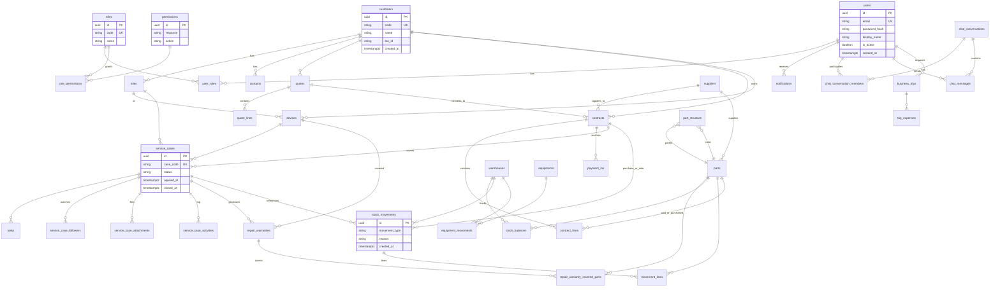
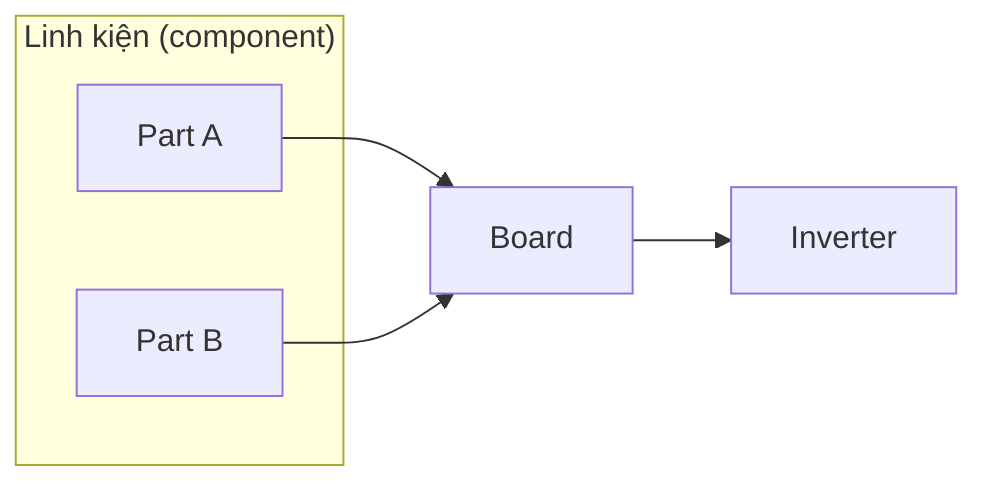

# SSE Inverter ERP — Database schema (draft)

Tài liệu tham chiếu cho **PostgreSQL** + **Prisma**: danh sách bảng, cột chính và quan hệ. Bản nháp để team chỉnh trước khi `prisma migrate`. Đồng bộ với [SKILL.md](./SKILL.md).

**Quy ước:** tên bảng/cột `snake_case`; khóa chính `id` kiểu `UUID` (hoặc `BIGSERIAL` — chốt một); timestamp `timestamptz`; tiền `numeric(18,2)` + `currency` (varchar) nếu đa tiền tệ.

---

## 1. Sơ đồ tổng thể (quan hệ chính)

---

## 2. Module 4 — Người dùng & RBAC

| Bảng | Mô tả ngắn |
|------|------------|
| `users` | Tài khoản đăng nhập (nội bộ + **portal KH**). Staff: `customer_id` NULL; portal: **`customer_id`** NOT NULL + role `customer_portal`. |
| `roles` | `code`: `dev`, `admin`, `accounting`, `warehouse`, `technician`, **`customer_portal`**, … |
| `permissions` | Từng quyền dạng `resource` + `action` (unique kết hợp). |
| `user_roles` | Nhiều-nhiều: `user_id`, `role_id` (PK ghép hoặc `id` surrogate). |
| `role_permissions` | Nhiều-nhiều: `role_id`, `permission_id`. |

**Cột gợi ý — `users`**

| Cột | Kiểu | Ghi chú |
|-----|------|--------|
| `id` | UUID / BIGSERIAL | PK |
| `email` | VARCHAR(255) | UNIQUE, NOT NULL |
| `password_hash` | TEXT | bcrypt/argon2 |
| `display_name` | VARCHAR(255) | |
| `is_active` | BOOLEAN | DEFAULT true |
| `customer_id` | FK → `customers` | NULL — bắt buộc khác NULL khi user chỉ dùng **portal KH** (mọi API portal filter theo cột này). |
| `created_at`, `updated_at` | TIMESTAMPTZ | |

**Ghi chú:** có thể thêm `is_superuser` cho tài khoản `dev` thay vì gán full permission — policy SSE quyết định. Nếu một email cần vừa staff vừa đại diện KH, dùng **hai user** hoặc bảng nối `customer_users` (`user_id`, `customer_id`) thay vì một `customer_id` duy nhất — team chốt.

**Portal KH — truy vấn an toàn**

- `service_case_activities`: portal **chỉ** `WHERE is_internal = false` và `service_case.customer_id = :session_customer_id`.  
- `service_case_attachments`: tuỳ chọn cột **`is_visible_to_customer`** (default `false`) — portal chỉ list file `true` nếu không muốn lộ mọi đính kèm nội bộ.

---

## 3. Module 1 — Tài chính nội bộ

| Bảng | Mô tả |
|------|--------|
| `customers` | Khách hàng / đối tác. |
| `contacts` | Người liên hệ thuộc `customer_id`. |
| `sites` | Địa điểm (trại/nhà máy/lắp đặt), FK `customer_id`. |
| `quotes` | Báo giá; FK `customer_id`, optional `site_id`; `status`. |
| `quote_lines` | Dòng báo giá: `quote_id`, **`line_fee_kind`** (repair \| warranty) khi báo giá dịch vụ; hoặc dòng hàng thiết bị (đồng bộ cách khai báo với `contract_lines` — team chốt). |
| `contracts` | Hợp đồng; **`contract_kind`**: **`repair_service`** (sửa chữa, thường một máy — optional `device_id`) \| **`equipment_purchase`** (mua vào từ NCC) \| **`equipment_sale`** (bán ra cho KH). `customer_id` bắt buộc với `repair_service` / `equipment_sale`; **`supplier_id`** → `suppliers` bắt buộc (hoặc strongly recommended) với **`equipment_purchase`**; optional `site_id`, optional `quote_id`; `status`; optional **`owner_user_id`** → `users`; optional **`expected_close_date`** / `due_at`. |
| `notifications` | Thông báo in-app: `user_id` (người nhận), `notification_type`, `title` / `body` hoặc i18n key + `payload` JSONB, `entity_type`, `entity_id`, **`read_at`** (NULL = chưa đọc), `created_at`. |
| `contract_lines` | Dòng HĐ — **phụ thuộc `contracts.contract_kind`:** (1) **`repair_service`:** bắt buộc **`line_fee_kind`**: **`repair`** \| **`warranty`**; `repair_warranty.contract_line_id` trỏ dòng **`warranty`**. (2) **`equipment_purchase`** / **`equipment_sale`:** mỗi dòng là **hàng thiết bị**: FK **`part_id`** → `parts` (SKU, thường `inverter` / `board`), `quantity`, `unit_price`, `line_total`; **`line_fee_kind`** = NULL; optional **`line_serial_number`** (SN giao dòng) hoặc liên kết `equipment_id` sau khi post nhập/xuất. |
| `payment_ins` | Thu tiền; FK optional `contract_id`, `customer_id`, optional **`contract_line_id`** (đối soát thu theo phí sửa vs phí BH); `amount`, `paid_at`, `method`. |
| `invoices` | (Tuỳ chọn) Hóa đơn: số, ngày, `contract_id`, `amount`, `status`. |
| `expenses` | Chi; `category`; `amount`, `spent_at`; FK optional tới `contract_id`, `service_case_id`, `business_trip_id`, `stock_movement_id`. |
| `cost_allocations` | (Tuỳ chọn) Phân bổ một `expense` sang nhiều `contract_id` + `amount`. |

**Quan hệ chính**

- `customers` 1 — N `sites`, `contacts`, `quotes`, `contracts`, `devices`.
- `quotes` 1 — N `quote_lines`; `contracts.quote_id` nullable (tạo từ báo giá hoặc tay).
- `contracts` 1 — N `contract_lines`, `payment_ins`, `service_cases` (nếu phiếu gắn HĐ — chủ yếu **`repair_service`**); optional N — 1 `users` qua `owner_user_id`; optional N — 1 `suppliers` qua **`supplier_id`** (HĐ mua vào); 1 — N **`stock_movements`** khi nhập/xuất gắn HĐ mua/bán thiết bị.
- `notifications` N — 1 `users`.

**`contracts.contract_kind` — ba nhóm nghiệp vụ**

| `contract_kind` | Ý nghĩa (UI i18n) | Dòng HĐ & công nợ |
|-----------------|-------------------|-------------------|
| `repair_service` | Hợp đồng **sửa chữa** (một máy) | `line_fee_kind` **repair** / **warranty**; công nợ theo từng loại phí. |
| `equipment_purchase` | **Mua vào** thiết bị (SSE ← NCC) | Dòng có **`part_id`** + SL + đơn giá; công nợ **phải trả** NCC (chi/expense/`payment_out` tùy team). |
| `equipment_sale` | **Bán ra** thiết bị (SSE → KH) | Dòng có **`part_id`** + SL + đơn giá; thu **`payment_in`**; công nợ KH. |

**Hợp đồng sửa một máy — hai loại phí (`line_fee_kind`, chỉ khi `contract_kind = repair_service`)**

| `line_fee_kind` | Ý nghĩa (UI i18n) |
|-----------------|-------------------|
| `repair` | **Phí sửa chữa** — công, linh kiện thay, board/inverter theo scope sửa. |
| `warranty` | **Phí bảo hành** — gói bảo hành / phụ phí BH ghi trên HĐ (khác với bản ghi `repair_warranty` sau khi bàn giao). |

- Tổng giá trị HĐ = tổng các dòng (HĐ sửa chữa: có thể `SELECT sum` group by `line_fee_kind`; HĐ mua/bán: group theo `part_id` hoặc gộp tổng).  
- **Công nợ theo loại (sửa chữa):** `sum(contract_lines)` theo kind − `sum(payment_ins)` gắn cùng `contract_line_id` hoặc cùng kind (tuỳ cách phân bổ thu).

**Báo cáo tài chính (theo tháng / quý)**

- **Không bảng tổng hợp bắt buộc:** đọc trực tiếp `payment_ins` (theo `paid_at`), `expenses` (theo `spent_at`), join **`contracts`** để lọc **`contract_kind`** (doanh thu bán thiết bị vs thu dịch vụ); join `contract_lines` khi cần tách **`line_fee_kind`** (HĐ sửa chữa).  
- **Bucket tháng/quý:** trong SQL/Prisma dùng timezone **Asia/Ho_Chi_Minh** (vd. `date_trunc('month', paid_at AT TIME ZONE 'UTC')` điều chỉnh theo convention lưu DB — team chốt lưu `timestamptz` hay `date` local).  
- **Index gợi ý:** `payment_ins(paid_at)`, `expenses(spent_at)` — range query báo cáo; đã có `expenses(spent_at)` ở mục chỉ mục, bổ sung `payment_ins` nếu chưa.

**Cột gợi ý — `contract_lines` / `quote_lines`**

| Cột | Kiểu | Ghi chú |
|-----|------|--------|
| `line_fee_kind` | enum NULL | `repair` \| `warranty` — **NOT NULL** iff `contract.contract_kind = repair_service`; **NULL** cho dòng hàng **`equipment_*`**. |
| `part_id` | FK → `parts` | NULL trừ khi dòng là **mua/bán thiết bị** — khi đó NOT NULL (validate ứng dụng). |
| `line_serial_number` | VARCHAR(255) | NULL — SN theo dòng (bán máy có serial). |
| `description` | TEXT / VARCHAR | |
| `quantity` | NUMERIC | DEFAULT 1 |
| `unit_price` | NUMERIC(18,2) | |
| `line_total` | NUMERIC(18,2) | hoặc tính từ quantity × unit |

**Cột gợi ý — `contracts` (bổ sung)**

| Cột | Kiểu | Ghi chú |
|-----|------|--------|
| `contract_kind` | enum | `repair_service` \| `equipment_purchase` \| `equipment_sale` — NOT NULL, default `repair_service` nếu migrate từ dữ liệu cũ. |
| `supplier_id` | FK → `suppliers` | NULL — dùng cho **`equipment_purchase`**. |

---

## 4. Module 2 — Dịch vụ & bảo hành

| Bảng | Mô tả |
|------|--------|
| `devices` | Biến tần: `customer_id`, optional `site_id`, **hãng sản xuất** `manufacturer`, **model**, **SN** `serial_number` (UNIQUE partial khi có giá trị — một SN chỉ thuộc một thiết bị). |
| `service_cases` | Phiếu sửa (ticket UI): `case_code` UNIQUE, `customer_id`, optional `site_id`, `device_id`, optional `contract_id`, `status`, **`case_kind`** (`repair` \| `warranty`), **`priority`**, optional **`title`**, optional **`incident_category`** (loại sự cố / tag), **`incident_description`**, SLA: **`sla_response_hours`**, **`sla_response_due_at`**, optional **`sla_onsite_note`**, **`sla_breached_at`**; `opened_at`, `closed_at`, `updated_at`, optional `assignee_user_id` → `users`. |
| `service_case_followers` | Người theo dõi: `service_case_id`, `user_id`, `created_at`. |
| `service_case_attachments` | File đính kèm phiếu: `service_case_id`, `file_key` / URL, `mime_type`, `uploaded_by_user_id`, **`is_visible_to_customer`** (BOOLEAN, default false — portal chỉ hiển thị khi true), `created_at`. |
| `service_case_activities` | Nhật ký + comment: `service_case_id`, `actor_user_id`, `activity_type` (status_change \| comment \| assignment \| …), `body`, **`is_internal`** (comment nội bộ), `metadata` JSONB, `created_at`. |
| `tasks` | Task: `service_case_id`, `title`, `status`, `assignee_user_id`, `due_at`. |
| `repair_warranties` | Bảo hành sau sửa: bắt buộc `service_case_id`, `device_id`; optional `contract_line_id` (**phải** là dòng HĐ `line_fee_kind = warranty` trên HĐ **`contract_kind = repair_service`** khi có liên kết); `starts_at`, `ends_at` hoặc `duration_months`; `warranty_type`, `terms_text`; optional `supersedes_warranty_id` → self. |
| `repair_warranty_covered_parts` | **Bổ sung spare khi có BH:** mỗi dòng = một `part_id` (linh kiện) thuộc phạm vi đổi/thay trong gói BH, optional `max_quantity` / `notes`. Khi không cần chi tiết từng part, có thể dùng một dòng `part_id` NULL + `coverage_notes` (policy SSE). |
| `business_trips` | Công tác: `requester_user_id`, `status`, `purpose`, `date_from`, `date_to`, optional `approved_by_user_id`. |
| `trip_expenses` | Chi phí chuyến: `business_trip_id`, `category`, `amount`, ghi chú/chứng từ. |

**Trạng thái `service_cases.status`** (text hoặc enum DB):  
`received` → `diagnosing` → `waiting_parts` → `in_repair` → `testing` → `delivered` → `closed` (+ `cancelled`).

**Quan hệ**

- `service_cases` N — 1 `customers`, optional `sites`, `devices`, `contracts`.
- `service_case_followers`, `service_case_attachments`, `service_case_activities` N — 1 `service_cases`.
- `repair_warranties` N — 1 `service_cases`, `devices`; optional N — 1 `contract_lines`.
- `repair_warranty_covered_parts` N — 1 `repair_warranties`; N — 1 `parts` (nullable `part_id` nếu chỉ ghi chú nhóm).
- `stock_movements.service_case_id` liên kết xuất kho với phiếu sửa (M3); **`repair_warranty_id`** khi xuất/nhập diễn ra **trong thời hạn BH** (sửa bảo hành).

**Cột gợi ý — `devices`**

| Cột | Kiểu | Ghi chú |
|-----|------|--------|
| `id` | UUID / BIGSERIAL | PK |
| `customer_id` | FK → `customers` | NOT NULL |
| `site_id` | FK → `sites` | NULL — vị trí lắp đặt nếu có |
| `manufacturer` | VARCHAR(255) | Hãng sản xuất (vd. Huawei, SMA, Fronius, Sungrow…). Tuỳ chọn: sau này chuẩn hóa bảng `manufacturers` + `manufacturer_id`. |
| `model` | VARCHAR(255) | Model/type biến tần |
| `serial_number` | VARCHAR(255) | **Số serial (SN)** thiết bị; NULL nếu chưa biết — khi có thì UNIQUE (partial index). |
| `notes` | TEXT | Ghi chú kỹ thuật |
| `created_at`, `updated_at` | TIMESTAMPTZ | |

---

## 5. Module 3 — Kho (ledger spare + máy)

| Bảng | Mô tả |
|------|--------|
| `suppliers` | Nhà cung cấp linh kiện. |
| `parts` | Danh mục spare: **mã part** `part_code`, **`part_kind`** (xem dưới), `name`, `unit`, optional `supplier_id` / mã NCC; `created_at`, `updated_at`. |
| `part_structure` | Quan hệ **lắp ráp / sửa chữa**: board lắp từ linh kiện, inverter lắp/sửa từ board — `parent_part_id`, `child_part_id`, `quantity`. |
| `warehouses` | Kho: `code` UNIQUE, `name`. |
| `stock_balances` | Tồn theo (`warehouse_id`, `part_id`): `quantity_on_hand`. Cập nhật khi **post** `stock_movement` (transaction ứng dụng hoặc trigger). |
| `stock_movements` | Phiếu nhập/xuất/điều chỉnh: **ngày nhập/xuất** `movement_at` / `document_date`; **`created_by_user_id`**; `movement_type`, `reason`, optional `service_case_id`, optional **`contract_id`** (nhập theo HĐ **mua vào** / xuất theo HĐ **bán ra** thiết bị), optional **`repair_warranty_id`** (bắt buộc khi `reason`/loại nghiệp vụ = sửa trong hạn BH — validate ứng dụng), `posted_at`. |
| `movement_lines` | Dòng phiếu: `stock_movement_id`, `part_id`, `quantity` (+/- theo convention), optional `unit_cost`. Mỗi dòng kế thừa **ngày** từ phiếu cha — tra cứu lịch sử theo `part_id` + `stock_movements.movement_at`. |
| `equipments` | Máy (khách/nội bộ): serial, loại, optional `customer_id`, optional `device_id` nếu ánh xạ 1-1. |
| `equipment_movements` | NX máy: `equipment_id`, optional `warehouse_id`, `movement_type`, optional `service_case_id`, `occurred_at`. |

**Nguyên tắc:** mọi thay đổi tồn spare đi qua `stock_movements` + `movement_lines`; `stock_balances` là **ẩn số phụ** (cache), không sửa tay ngoài luồng.

**Phân loại part & chuỗi sửa chữa (SSE)**

Danh mục `parts` chia **ba cấp** (một cột phân biệt — không phải hai bảng riêng):

| `part_kind` | Ý nghĩa nghiệp vụ |
|-------------|-------------------|
| `component` | **Linh kiện** — nhập từ NCC, có **ngày nhập** và **người nhập** trên từng phiếu nhập (`stock_movements.movement_at` + `created_by_user_id`). |
| `board` | **Board** — thành phẩm / tầng trung gian **được sửa / lắp từ linh kiện**; cấu thành khai báo trong `part_structure` (con là các `component`). |
| `inverter` | **Inverter** (mức máy) — **được sửa / lắp từ board** (+ có thể thêm linh kiện); quan hệ con trong `part_structure` (con là `board` và/hoặc `component` tùy quy trình SSE). |

- **Liên kết với phiếu sửa:** xuất `component` / nhập `board` hoặc `inverter` sau sửa có thể gắn `service_case_id` + `reason` (vd. `repair_assembly`).  
- **Thiết bị khách** vẫn dùng bảng `devices` (SN, hãng); `parts` loại `inverter` có thể là **SKU phụ tùng / đơn vị kho** song song với thiết bị cụ thể — team chốt mapping (vd. một `device` ↔ nhiều part inverter theo model).

**Spare part — mã part & các “ngày” (phân tách đúng chỗ)**

| Nhu cầu | Nguồn dữ liệu |
|---------|----------------|
| **Mã part** | Cột `parts.part_code` (bắt buộc, UNIQUE). Có thể thêm `supplier_part_number` nếu khác mã nội bộ. |
| **Ngày nhập hàng** | Phiếu **nhập** (`movement_type` = in), chủ yếu cho **`part_kind` = component**: `movement_at` / `document_date`. **Người nhập** = `stock_movements.created_by_user_id` (hoặc cột `recorded_by_user_id` nếu tách người tạo phiếu vs người nhận hàng). Board/inverter nhập kho (sau sửa) cũng dùng cùng cơ chế. |
| **Ngày xuất hàng** | Phiếu loại **xuất** (`movement_type` = out): cùng cột thời gian trên `stock_movements`. Nếu xuất cho sửa chữa, `service_case_id` xác định phiếu dịch vụ. |
| **Ngày sửa** | **(1)** Sửa *danh mục* linh kiện: `parts.updated_at`. **(2)** Linh kiện *được dùng để sửa máy*: không lưu trên `parts` — lấy **ngày phiếu xuất** (`stock_movements.movement_at`) có `service_case_id` + dòng `movement_lines` chứa `part_id`. |

**Cột gợi ý — `parts`**

| Cột | Kiểu | Ghi chú |
|-----|------|--------|
| `id` | UUID / BIGSERIAL | PK |
| `part_code` | VARCHAR(64) | **Mã part** nội bộ; UNIQUE, NOT NULL |
| `part_kind` | enum | `component` \| `board` \| `inverter` — NOT NULL |
| `name` | VARCHAR(255) | Tên mô tả |
| `unit` | VARCHAR(32) | Đơn vị (cái, bộ, m…) |
| `supplier_id` | FK → `suppliers` | NULL |
| `supplier_part_number` | VARCHAR(128) | NULL — mã theo nhà cung cấp (tuỳ chọn) |
| `category` | VARCHAR(128) | NULL — nhóm linh kiện |
| `created_at`, `updated_at` | TIMESTAMPTZ | `updated_at` = **ngày/giờ sửa** bản ghi danh mục |

**Cột gợi ý — `stock_movements` (bổ sung cho ngày NX)**

| Cột | Kiểu | Ghi chú |
|-----|------|--------|
| `movement_at` | TIMESTAMPTZ | **Ngày giờ nghiệp vụ** nhập/xuất (thường hiển thị là “ngày nhập / ngày xuất”). |
| `document_date` | DATE | Tuỳ chọn — ngày trên hóa đơn/phiếu giấy nếu khác `movement_at`. |
| `posted_at` | TIMESTAMPTZ | Khi phiếu được khóa/ghi sổ (có thể = `movement_at` nếu đơn giản). |
| `movement_type` | enum | `in` \| `out` \| `adjustment` |
| `reference_number` | VARCHAR(128) | NULL — số chứng từ ngoài |
| `created_by_user_id` | FK → `users` | Người lập phiếu; với **nhập linh kiện** hiển thị là **người nhập** |
| `service_case_id` | FK → `service_cases` | NULL — xuất/nhập phục vụ phiếu sửa |
| `contract_id` | FK → `contracts` | NULL — nhập/xuất theo HĐ **`equipment_purchase`** / **`equipment_sale`** |
| `repair_warranty_id` | FK → `repair_warranties` | NULL — gắn khi xuất/nhập spare **liên quan bảo hành** (trong hạn, đối soát với `repair_warranty_covered_parts` nếu có) |

**Bảng `repair_warranty_covered_parts`**

| Cột | Kiểu | Ghi chú |
|-----|------|--------|
| `id` | UUID / BIGSERIAL | PK |
| `repair_warranty_id` | FK → `repair_warranties` | NOT NULL |
| `part_id` | FK → `parts` | NULL nếu chỉ mô tả nhóm bằng chữ |
| `max_quantity` | INT | NULL = không giới hạn số lần/số lượng theo policy |
| `notes` | TEXT | Điều kiện (vd. chỉ đổi khi lỗi X) |
| `created_at` | TIMESTAMPTZ | |

Unique tuỳ chọn: `(repair_warranty_id, part_id)` khi `part_id` NOT NULL.

**Bảng `part_structure` (BOM / cấu thành sửa chữa)**

| Cột | Kiểu | Ghi chú |
|-----|------|--------|
| `id` | UUID / BIGSERIAL | PK |
| `parent_part_id` | FK → `parts` | Cha: `board` hoặc `inverter` |
| `child_part_id` | FK → `parts` | Con: `component` (dưới board) hoặc `board` (dưới inverter) |
| `quantity` | NUMERIC(18,4) | Số lượng con cho một đơn vị cha |
| `created_at` | TIMESTAMPTZ | |

Ràng buộc logic (ứng dụng hoặc trigger): `parent_part_id` ≠ `child_part_id`; quy tắc SSE — ví dụ **board** chỉ có con là **component**; **inverter** có con là **board** (và tùy chọn thêm **component**). Tránh chu trình (cycle) trong đồ thị BOM.

---

## 5a. Chat nội bộ (staff only)

**Phạm vi:** tin nhắn giữa **user nội bộ** (`customer_id` NULL). **Portal KH** (`customer_portal`) **không** có bảng/chat này trong API của họ.

| Bảng | Mô tả |
|------|--------|
| `chat_conversations` | Một cuộc trò chuyện: **`conversation_type`**: `direct` (1-1) \| `group`; `title` (NULL nếu direct — UI hiển thị tên đối phương); optional `created_by_user_id`; `created_at`, `updated_at`, optional **`last_message_at`** (denormalize để sort danh sách). |
| `chat_conversation_members` | Thành viên: `conversation_id`, `user_id`, **`joined_at`**, **`left_at`** (NULL = còn trong nhóm); optional **`member_role`**: `member` \| `owner` (chủ nhóm — mời/xóa thành viên nếu có quyền `chat.group:manage`). Unique `(conversation_id, user_id)` khi chỉ lưu một dòng “đời” mỗi user; hoặc lịch sử join/leave nhiều dòng — team chốt. |
| `chat_messages` | Tin: `conversation_id`, **`sender_user_id`**, `body` (TEXT hoặc JSONB nếu sau này rich text), `created_at`; optional `edited_at`, **`deleted_at`** (soft delete). |

**Đọc cuộc trò chuyện — policy (ứng dụng, không chỉ SQL)**

| Tình huống | Điều kiện truy cập |
|------------|---------------------|
| User thường | Là thành viên **active** (`left_at IS NULL`) của `conversation_id`. |
| **Admin / giám sát** | Permission **`chat.conversation:read_all`** — được **list và đọc mọi** `chat_conversations` + `chat_messages` **không cần** dòng trong `chat_conversation_members`. Nên ghi **`audit_logs`** khi supervisor mở cuộc (vd. `action = chat_supervisor_open`, `entity_type = chat_conversation`). |

**Gửi tin:** chỉ nếu có **`chat.message:write`** và (thành viên active **hoặc** policy SSE cho phép bot/system user).

**Nhóm mới:** user có **`chat.group:create`** tạo `conversation_type = group`, `title`, tự thêm vào `members` với `member_role = owner`, mời user khác.

**Quan hệ**

- `chat_conversations` 1 — N `chat_conversation_members`, `chat_messages`.
- `chat_messages` N — 1 `users` (sender).
- `direct`: đúng hai thành viên active — enforce ở service layer; tránh tạo trùng cặp user A–B.

**Cột gợi ý — `chat_conversations`**

| Cột | Kiểu | Ghi chú |
|-----|------|--------|
| `id` | UUID / BIGSERIAL | PK |
| `conversation_type` | enum | `direct` \| `group` |
| `title` | VARCHAR(255) | NULL nếu direct |
| `created_by_user_id` | FK → `users` | NULL cho direct mở từ UI “nhắn lần đầu” |
| `last_message_at` | TIMESTAMPTZ | NULL — cập nhật khi có tin mới |
| `created_at`, `updated_at` | TIMESTAMPTZ | |

**Cột gợi ý — `chat_messages`**

| Cột | Kiểu | Ghi chú |
|-----|------|--------|
| `id` | UUID / BIGSERIAL | PK |
| `conversation_id` | FK → `chat_conversations` | NOT NULL, index với `created_at` |
| `sender_user_id` | FK → `users` | NOT NULL |
| `body` | TEXT | Nội dung; sanitize XSS phía hiển thị |
| `created_at` | TIMESTAMPTZ | |
| `edited_at`, `deleted_at` | TIMESTAMPTZ | NULL |

**Permission seed gợi ý** (bảng `permissions`): `chat.conversation:read`, `chat.message:write`, `chat.group:create`, `chat.group:manage`, **`chat.conversation:read_all`**. Gán `read_all` cho role **`admin`** (và tuỳ chọn **`dev`**); **không** gán cho `customer_portal`.

---

## 6. Audit & liên chéo

| Bảng | Mô tả |
|------|--------|
| `audit_logs` | `actor_user_id`, `action`, `entity_type`, `entity_id`, `payload` JSONB, `created_at`. |

**Liên chéo đã thiết kế**

- `expenses` → `service_case`, `business_trip`, `stock_movement`, `contract`.
- `stock_movements` → `service_case` (xuất cho sửa); → **`contract`** (nhập/xuất theo HĐ mua/bán thiết bị); → `repair_warranty` (xuất/nhập trong phạm vi BH).
- `repair_warranty_covered_parts` → định nghĩa spare **bổ sung** theo từng gói BH.
- `equipment_movements` → `service_case` (máy vào/ra bảo hành).
- `payment_ins` / `contracts` → công nợ theo KH.
- Worker / hook sau khi ghi `service_case`, `task`, `contract`… tạo bản ghi **`notifications`** cho user liên quan (assignee, followers, `contracts.owner_user_id`).
- `chat_messages` → thông báo thành viên cuộc (tuỳ cấu hình); supervisor **`read_all`** không nhận notification hàng loạt trừ khi spec yêu cầu.

**Cột gợi ý — `notifications`**

| Cột | Kiểu | Ghi chú |
|-----|------|--------|
| `id` | UUID / BIGSERIAL | PK |
| `user_id` | FK → `users` | Người nhận |
| `notification_type` | enum | vd. `case_assigned`, `case_status`, `sla_warning`, `task_due`, `contract_action`, **`chat_message`**, … |
| `title` | VARCHAR(500) | hoặc chỉ dùng `payload` + i18n key trên client |
| `body` | TEXT | NULL |
| `entity_type` | VARCHAR(64) | `service_case` \| `contract` \| `task` \| **`chat_conversation`** \| … |
| `entity_id` | UUID | |
| `payload` | JSONB | Tham số dịch / deeplink |
| `read_at` | TIMESTAMPTZ | NULL = chưa đọc |
| `created_at` | TIMESTAMPTZ | |

---

## 7. Chỉ mục gợi ý

- Mọi **FK** nên có index phía “N” (vd. `service_cases(customer_id)`, `service_cases(device_id)`, `movement_lines(stock_movement_id)`).
- `service_cases(case_code)` UNIQUE; `service_cases(sla_response_due_at)` (job cảnh báo SLA); `devices(serial_number)` UNIQUE WHERE `serial_number` IS NOT NULL (partial index).
- `service_case_followers(service_case_id)`, `service_case_activities(service_case_id, created_at DESC)`.
- `devices(manufacturer)` (index thường) để lọc/báo cáo theo hãng.
- `repair_warranties(ends_at)` cho cảnh báo hết hạn.
- `contract_lines(contract_id, line_fee_kind)` — tổng hợp phí sửa vs phí BH theo HĐ (HĐ sửa chữa); `contract_lines(part_id)` khi báo cáo theo SKU.
- `contracts(owner_user_id, status)` — Dashboard “HĐ của tôi”; **`contracts(contract_kind)`** — lọc danh sách / báo cáo; **`contracts(supplier_id)`** — HĐ mua NCC.
- `tasks(assignee_user_id, due_at)` — Dashboard task + cảnh báo hạn.
- `notifications(user_id, created_at DESC)`; partial index `WHERE read_at IS NULL` (unread) nếu volume lớn.
- `stock_movements(movement_at)`, `stock_movements(warehouse_id, movement_type)`, `stock_movements(repair_warranty_id)` — báo cáo nhập/xuất / **xuất BH**; **`stock_movements(contract_id)`** — đối soát NX với HĐ mua/bán thiết bị; `movement_lines(part_id)` — lịch sử theo từng part.
- `repair_warranty_covered_parts(repair_warranty_id)`.
- `expenses(spent_at)` cho báo cáo kỳ; `payment_ins(paid_at)` cho **báo cáo thu theo tháng/quý**.
- `parts(part_code)` UNIQUE; `parts(part_kind)` để lọc linh kiện / board / inverter; `part_structure(parent_part_id)`, `part_structure(child_part_id)`.
- `parts(updated_at)` nếu cần audit danh mục.
- **`chat_messages(conversation_id, created_at DESC)`** — lịch sử theo cuộc; **`chat_conversation_members(user_id)`** WHERE `left_at IS NULL` — danh sách cuộc của user; **`chat_conversations(conversation_type, last_message_at DESC)`** — admin list.

---

## 8. Bước tiếp theo trong repo code

1. Chuyển bảng/cột sang `schema.prisma` với `@@map("table_name")` nếu model dùng PascalCase.  
2. Thêm enum Prisma cho `service_cases.status`, `service_cases.case_kind`, `service_cases.priority`, `contracts.status`, **`contracts.contract_kind`**, `contract_lines.line_fee_kind` (nullable khi dòng thuộc HĐ thiết bị), `stock_movements.movement_type`, `parts.part_kind`, `service_case_activities.activity_type`, `notifications.notification_type`, **`chat_conversations.conversation_type`**, **`chat_conversation_members.member_role`**, …  
3. Migration đầu tiên; seed `roles`, `permissions`, `role_permissions` cho SSE (**gồm quyền chat**; **`chat.conversation:read_all`** → `admin`, tuỳ chọn `dev`).

---

*Tài liệu có thể chỉnh sửa theo quyết định nghiệp vụ (ví dụ gộp `quote` vào `contract` dạng nháp, hay tách kho âm ký riêng).*
